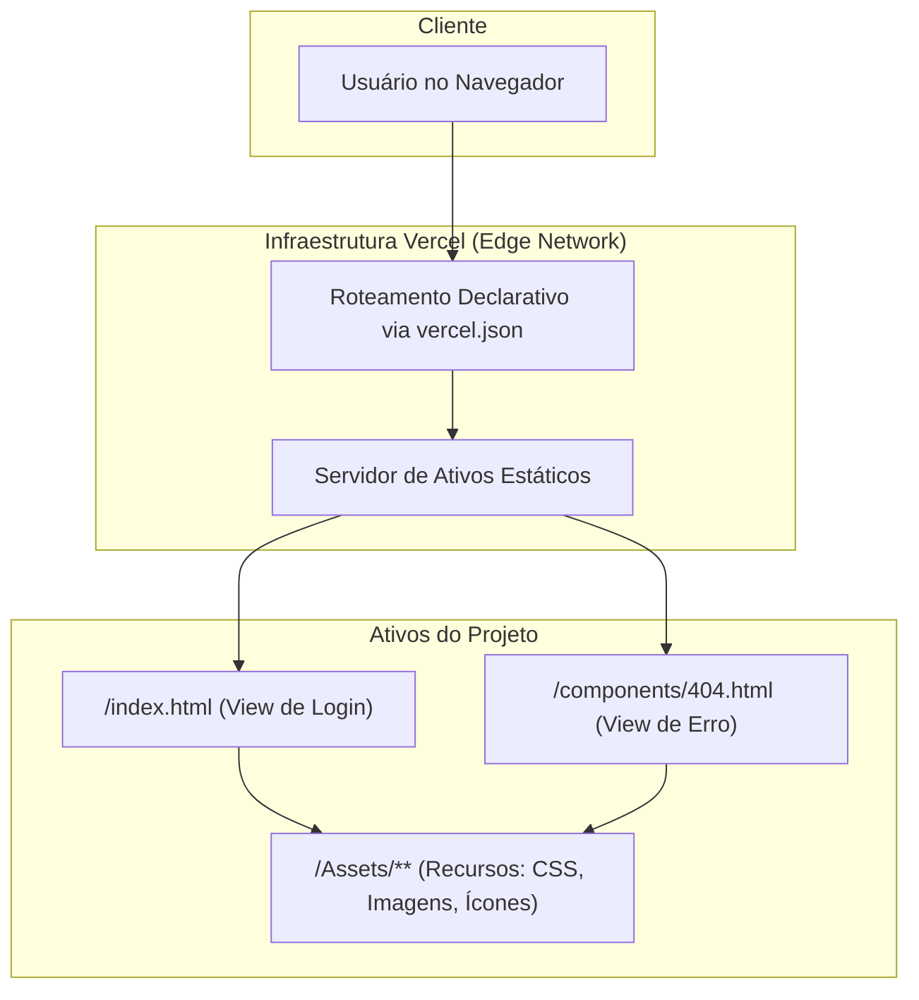

# Sistema de Interface de Login Responsivo e Estilizado

**Uma Abordagem Declarativa para Interfaces de Autenticação Seguras e Esteticamente Aprimoradas.**

<p align="center">
  <a href="https://login-indol-seven.vercel.app" target="_blank" rel="noopener noreferrer">
    
  </a>
</p>

---

## Abstract (Resumo Técnico)

Este projeto materializa uma interface de autenticação de usuário puramente client-side, concebida com HTML5 e CSS3 avançado, que demonstra uma fusão entre estética funcional e robustez técnica. O problema central abordado é a prevalência de experiências de login genéricas, que frequentemente carecem de tratamento elegante para rotas de navegação inválidas e falham em engajar o usuário visualmente.

A solução proposta é uma interface estática, responsiva e visualmente dinâmica, que emprega animações baseadas em CSS para criar um ambiente imersivo sem sobrecarga de dependências JavaScript para efeitos presentacionais. A metodologia principal baseia-se no uso de gradientes, transformações e animações de partículas em CSS, combinada com arquitetura de implantação serverless na plataforma Vercel.

A configuração de roteamento declarativa, definida em `vercel.json`, gerencia o fluxo de navegação, redirecionando todas as rotas não especificadas para uma página de erro 404 personalizada, garantindo experiência de usuário coesa e à prova de falhas. A contribuição singular reside na capacidade de entregar uma experiência rica através de técnicas de CSS puro, utilizando infraestrutura como código para gerenciamento de rotas.

## Badges Abrangentes


## Sumário (Table of Contents)

1. [Introdução e Motivação](#introdução-e-motivação)
2. [🎬 Demonstração Visual](#-demonstração-visual)
3. [Arquitetura do Sistema](#arquitetura-do-sistema)
4. [Decisões de Design Chave](#decisões-de-design-chave)
5. [✨ Funcionalidades Detalhadas (com Casos de Uso)](#-funcionalidades-detalhadas-com-casos-de-uso)
6. [🛠️ Tech Stack Detalhado](#️-tech-stack-detalhado)
7. [📂 Estrutura Detalhada do Código-Fonte](#-estrutura-detalhada-do-código-fonte)
8. [📋 Pré-requisitos Avançados](#-pré-requisitos-avançados)
9. [🚀 Guia de Instalação e Configuração](#-guia-de-instalação-e-configuração)
10. [⚙️ Uso Avançado e Exemplos](#️-uso-avançado-e-exemplos)
11. [🧪 Estratégia de Testes e Qualidade de Código](#-estratégia-de-testes-e-qualidade-de-código)
12. [🚢 Deployment Detalhado e Escalabilidade](#-deployment-detalhado-e-escalabilidade)
13. [❓ FAQ (Perguntas Frequentes)](#-faq-perguntas-frequentes)
14. [📜 Licença e Aspectos Legais](#-licença-e-aspectos-legais)
15. [📞 Contato](#-contato)

## Introdução e Motivação

A interface de autenticação representa o portal de entrada para a vasta maioria dos sistemas digitais, constituindo um ponto de contato crítico que molda a percepção inicial do usuário sobre a qualidade e sofisticação de uma aplicação. No entanto, este componente é frequentemente relegado a um design utilitário e genérico, que falha em capitalizar a oportunidade de criar uma primeira impressão positiva e memorável.

Este projeto nasceu da motivação de desafiar esse status quo, desenvolvendo um componente de frontend para login que seja não apenas funcionalmente completo, mas também esteticamente superior, robusto em seu tratamento de erros e tecnicamente elegante. A proposta de valor reside na criação de uma experiência de usuário imersiva e responsiva, utilizando exclusivamente o poder do CSS3 moderno para animações e efeitos visuais.

Essa escolha deliberada visa minimizar a dependência de JavaScript para fins puramente presentacionais, traduzindo-se em redução do bundle size, melhor performance de renderização e manutenibilidade simplificada.

## 🎬 Demonstração Visual

<p align="center">
  <a href="https://login-indol-seven.vercel.app" target="_blank">
    
  </a>
</p>

> **Demonstração interativa:** A imagem acima mostra a interface de login com animações de partículas flutuantes, efeitos de glassmorphism, campos de entrada com transições suaves e página 404 personalizada.

## Arquitetura do Sistema

A arquitetura do projeto é fundamentada no modelo de **Site Estático (Static Site)**, onde todos os ativos (HTML, CSS, imagens) são pré-construídos e servidos diretamente de uma rede de distribuição de conteúdo (CDN). Esta abordagem maximiza performance, segurança e escalabilidade, eliminando necessidade de servidor de aplicação para a camada de apresentação.



**Explicação do Fluxo:**
1. **Usuário** faz requisição HTTP para caminho no domínio
2. Requisição é interceptada na **Edge Network da Vercel**, onde regras do `vercel.json` são avaliadas
3. Se rota for raiz (`/`), Vercel serve `index.html`
4. Se rota for qualquer outra (`/(.*)`), Vercel serve `components/404.html` com status HTTP 404
5. **Servidor de Ativos Estáticos** entrega arquivo HTML solicitado
6. Navegador renderiza HTML e solicita recursos associados do diretório `/Assets`

## Decisões de Design Chave

1. **Animações em CSS Puro:** Implementação de todas as animações visuais (partículas flutuantes, gradientes animados, efeitos de hover e foco) utilizando exclusivamente CSS3 (`@keyframes`, `transforms`, `pseudo-elements`).

2. **Roteamento em Nível de Infraestrutura:** Lógica de roteamento delegada à configuração da plataforma de deploy (`vercel.json`) em vez de roteador JavaScript no cliente.

3. **Fonte Tipográfica via CDN:** Fonte `Roboto` carregada diretamente do Google Fonts para acesso a família versátil e legível sem hospedar arquivos localmente.

4. **Encapsulamento de Estilos:** `index.html` contém bloco `<style>` extenso, mantendo estrutura e estilo da página de login contidos em único arquivo.

5. **Efeitos Glassmorphism:** Uso de `backdrop-filter: blur()` e transparências para criar interface moderna com profundidade visual.

## ✨ Funcionalidades Detalhadas (com Casos de Uso)

### 1. Formulário de Autenticação Padrão

**Propósito:** Formulário clássico com campos para username e password, acompanhado por botão de login com efeitos de foco e transições suaves.

**Caso de Uso:** Usuário registrado insere credenciais para ganhar acesso a área restrita do sistema, com feedback visual imediato através de animações.

### 2. Opções de Login Social (Single Sign-On)

**Propósito:** Botões de acesso para autenticação via provedores externos (Google e Microsoft) representados por ícones oficiais com efeitos hover.

**Caso de Uso:** Novo usuário opta por método de login federado para agilizar acesso, evitando necessidade de criar e memorizar nova senha específica.

### 3. Links de Suporte e Navegação Secundária

**Propósito:** Links discretos mas acessíveis para funcionalidades de suporte: "Reset password", "Privacy" e "Terms".

**Caso de Uso:** Usuário que esqueceu credenciais pode iniciar fluxo de recuperação de senha, ou consultar termos legais antes de prosseguir com login.

### 4. Gerenciamento de Erro de Rota (Página 404 Personalizada)

**Propósito:** Tentativas de acessar URLs inexistentes resultam em página de erro 404 amigável com GIF animado e link claro para retornar à página inicial.

**Caso de Uso:** Usuário digita URL incorreta ou segue link quebrado, sendo recebido por experiência de marca que orienta de volta ao fluxo principal, prevenindo frustração.

### 5. Atmosfera Visual Dinâmica

**Propósito:** Interface enriquecida com partículas flutuantes animadas, gradientes dinâmicos e efeitos de profundidade visual.

**Caso de Uso:** Usuário experiencia interface moderna e envolvente que transmite profissionalismo e atenção aos detalhes da aplicação.

## 🛠️ Tech Stack Detalhado

| Categoria | Tecnologia | Versão | Propósito no Projeto | Justificativa da Escolha |
| :--- | :--- | :--- | :--- | :--- |
| **Frontend** | **HTML5** | N/A | Estruturação semântica do conteúdo da interface | Padrão universal para web, máxima compatibilidade e acessibilidade |
| **Estilização** | **CSS3** | N/A | Design visual, responsividade e animações complexas | Interface rica e dinâmica sem dependências externas, aceleração hardware |
| **Fontes** | **Google Fonts (Roboto)** | N/A | Fornecimento da família de fontes tipográficas | CDN de alta performance para fontes de qualidade, melhor tipografia |
| **Deployment** | **Vercel** | N/A | Hospedagem, CI/CD e roteamento de borda | Integração perfeita com GitHub, rede global, configuração declarativa |
| **Configuração** | **vercel.json** | N/A | Definição de regras de reescrita de URL (roteamento) | Infraestrutura como Código para gerenciar comportamento de forma versionável |
| **Configuração** | **.htaccess** | N/A | Configuração para servidores Apache (portabilidade) | Compatibilidade com ambientes de hospedagem baseados em Apache |
| **JavaScript** | **Vanilla JS** | ES6+ | Efeitos interativos e simulação de loading | Funcionalidades mínimas sem dependências externas |

## 📂 Estrutura Detalhada do Código-Fonte

```
Login-main/
├── .htaccess                # Configuração para servidores Apache
├── Assets/                  # Recursos estáticos da aplicação
│   ├── Erro/
│   │   └── 404.gif         # GIF animado para página de erro
│   ├── Image/
│   │   └── Login.png       # Screenshot do projeto para documentação
│   └── Login/
│       ├── googleIcon.svg  # Ícone de login do Google
│       └── microsoft.svg   # Ícone de login da Microsoft
├── LICENSE                  # Arquivo de licença MIT
├── components/              # Componentes de UI desacoplados
│   ├── 404.css             # Folha de estilos específica para página 404
│   └── 404.html            # Estrutura HTML da página de erro 404
├── index.html              # Ponto de entrada principal e página de login
├── styles.css              # Folha de estilos global (versão base)
├── vercel.json             # Configuração de deploy para Vercel
└── README.md               # Este arquivo de documentação
```

**Detalhamento dos Arquivos:**

- `index.html`: Ponto de entrada contendo estrutura HTML e CSS avançado embutido para otimização
- `components/404.html`: Página de erro personalizada com design consistente
- `Assets/`: Diretório com todos os recursos visuais (ícones SVG, imagens, GIFs)
- `vercel.json`: Configuração de rewrites para comportamento de SPA e tratamento de 404
- `styles.css`: Folha de estilos base (versão modular para refatoração futura)

## 📋 Pré-requisitos Avançados

**Para Usuários:**
- **Navegador Web Moderno:** Chrome, Firefox, Edge, Safari (suporte a HTML5, CSS3, backdrop-filter)

**Para Desenvolvimento:**
- **Git:** Sistema de controle de versão para clonar e versionar código
- **Editor de Código:** VS Code, Sublime Text ou similar
- **Vercel CLI (Opcional):** Para deploys via linha de comando

Nenhuma dependência de runtime (Node.js) ou processo de compilação é necessário para executar o projeto.

## 🚀 Guia de Instalação e Configuração

A aplicação foi projetada para execução sem dependências ou processos de compilação.

1. **Clonar o Repositório:**
```bash
git clone https://github.com/ESousa97/Login.git
cd Login-main
```

2. **Execução Local:**
Como projeto puramente estático, não há passo de instalação de dependências:

```bash
# Método Simples
# Abra index.html diretamente no navegador

# macOS
open index.html

# Linux
xdg-open index.html

# Windows
start index.html
```

3. **Servidor Local (Recomendado):**
Para melhor experiência de desenvolvimento:

```bash
# Com Python
python -m http.server 8000

# Com Node.js
npx serve .

# Com VS Code Live Server
# Clique com botão direito em index.html
# Selecione "Open with Live Server"
```

4. **Simulando Ambiente de Deploy:**
O redirecionamento para página 404 é funcionalidade da Vercel e **não funcionará localmente**. Para testar este comportamento, o projeto deve ser implantado na Vercel.

### Scripts de Desenvolvimento
```bash
# Validação HTML
npx html-validate index.html

# Validação CSS
npx stylelint "**/*.css"

# Otimização de imagens
npx imagemin Assets/**/*.{png,jpg,svg} --out-dir=optimized/
```

## ⚙️ Uso Avançado e Exemplos

**Integração como Componente Reutilizável:**

Para integrar esta interface em projeto existente (React, Vue, Angular):

1. **Adaptação da Estrutura (HTML):**
```jsx
// Exemplo para React
const LoginComponent = () => {
  return (
    <div className="login-box">
      <h1 className="login-title">Login</h1>
      <div className="input-group">
        <label htmlFor="username">User</label>
        <div className="input-wrapper">
          <input type="text" id="username" placeholder="Enter your username" />
        </div>
      </div>
      {/* ... resto da estrutura */}
    </div>
  );
};
```

2. **Extração e Integração de Estilos:**
```css
/* Extrair do bloco <style> do index.html */
.login-box {
  background: rgba(31, 31, 31, 0.95);
  backdrop-filter: blur(20px);
  /* ... resto dos estilos */
}
```

3. **Conexão da Lógica de Autenticação:**
```javascript
const handleLogin = async (credentials) => {
  try {
    const response = await fetch('/api/auth/login', {
      method: 'POST',
      headers: { 'Content-Type': 'application/json' },
      body: JSON.stringify(credentials)
    });
    // Processar resposta
  } catch (error) {
    console.error('Login failed:', error);
  }
};
```

**Customização de Temas:**
```css
:root {
  --primary-gradient: linear-gradient(135deg, #4a90e2, #7f23f8);
  --glass-bg: rgba(31, 31, 31, 0.95);
  --accent-color: #4a90e2;
}

/* Para tema claro */
.light-theme {
  --primary-gradient: linear-gradient(135deg, #e3f2fd, #bbdefb);
  --glass-bg: rgba(255, 255, 255, 0.95);
  --accent-color: #1976d2;
}
```

## 🧪 Estratégia de Testes e Qualidade de Código

**Qualidade Atual:**
- Validação manual em principais navegadores (Chrome, Firefox, Edge)
- Testes de responsividade em diferentes resoluções
- Verificação de animações e efeitos visuais

**Estratégia de Testes Proposta:**

**Testes de Regressão Visual:**
- **Percy ou Chromatic:** Capturar screenshots da UI e comparar entre commits
- **Backstop.js:** Testes visuais automatizados para detectar alterações indesejadas

**Testes End-to-End (E2E):**
- **Cypress:** Simular interação do usuário (preenchimento de formulário, cliques)
- **Playwright:** Testes cross-browser para validar fluxos de navegação

**Testes de Performance:**
- **Lighthouse:** Análise de performance, acessibilidade e SEO
- **WebPageTest:** Testes de velocidade de carregamento

**Testes de Acessibilidade:**
- **axe-core:** Verificação automática de conformidade WCAG
- **Wave:** Análise de acessibilidade web

## 🚢 Deployment Detalhado e Escalabilidade

**Plataforma:** Implantado na **Vercel** com otimização para aplicações frontend.

**Processo de CI/CD:**
- Deploy totalmente automatizado via integração GitHub
- Cada `git push` para branch `main` aciona novo build e deploy
- Zero configuração necessária (detecção automática de projeto estático)

**Configuração (`vercel.json`):**
```json
{
  "rewrites": [
    { "source": "/", "destination": "/index.html" },
    { "source": "/(.*)", "destination": "/components/404.html" }
  ]
}
```

**Escalabilidade:**
- **Inerentemente alta:** Arquitetura estática garante escalabilidade excepcional
- **Edge Network Global:** Ativos distribuídos globalmente com cache próximo aos usuários
- **Latência mínima:** Resultados em latências extremamente baixas mundialmente
- **Picos de tráfego:** Capaz de lidar com picos massivos sem degradação

**Otimizações de Produção:**
```bash
# Minificação de CSS
npx clean-css-cli --output styles.min.css styles.css

# Compressão de imagens
npx imagemin Assets/**/*.{png,jpg,svg} --out-dir=dist/

# Análise de bundle
npx bundlephobia index.html

# Otimização de SVG
npx svgo Assets/Login/*.svg
```

## ❓ FAQ (Perguntas Frequentes)

**P: Por que a maior parte do CSS está inline no arquivo `index.html`?**
**R:** Decisão de design para manter componente de login autocontido, facilitando "copiar e colar" para outros projetos. Refatoração futura moveria estilos para arquivos externos.

**P: Como conectar esta interface ao meu sistema de backend?**
**R:** Adicione JavaScript para: 1) Capturar evento de submissão do formulário; 2) Coletar valores dos campos; 3) Enviar dados para endpoint de API de autenticação usando fetch ou axios.

**P: A página 404 não funciona quando abro o projeto localmente. Por quê?**
**R:** Redirecionamento para página 404 é regra processada pela infraestrutura da Vercel. Este comportamento não é replicado ao abrir arquivo `index.html` localmente.

**P: Posso usar o código deste projeto?**
**R:** Sim. Licença MIT permite uso, modificação e distribuição livres para projetos pessoais ou comerciais, mantendo aviso de copyright.

**P: Como personalizar as cores e animações?**
**R:** Edite as variáveis CSS no bloco `<style>` ou extraia para arquivo CSS separado. Modifique propriedades de gradientes e animações conforme necessário.

**P: É possível adicionar autenticação de dois fatores (2FA)?**
**R:** A interface atual é apenas frontend. Para 2FA, seria necessário adicionar JavaScript para capturar código adicional e integrar com backend que suporte autenticação multi-fator.

## 📜 Licença e Aspectos Legais

Este projeto é distribuído sob a **Licença MIT**, uma licença permissiva que permite reutilização, modificação e distribuição do código (inclusive para fins comerciais), desde que o aviso de copyright original seja mantido.

**Nota importante:** Conforme especificado no arquivo de licença, contribuições externas a este repositório não são aceitas no momento. O projeto é mantido como trabalho de portfólio e demonstração técnica.

Para detalhes completos, consulte o arquivo [LICENSE](https://github.com/ESousa97/Login/blob/main/LICENSE).

## 📞 Contato

- **GitHub:** [@ESousa97](https://github.com/ESousa97)
- **LinkedIn:** [José Enoque Sousa](https://www.linkedin.com/in/enoque-sousa-bb89aa168/)
- **Demo Online:** [login-indol-seven.vercel.app](https://login-indol-seven.vercel.app)
- **Issues:** Para bugs e sugestões, use [GitHub Issues](https://github.com/ESousa97/Login/issues)

---

<p align="center">
  
  
</p>

<p align="center">
  <em>Desenvolvido com ❤️ por José Enoque - Elevando experiências de autenticação através de design e tecnologia</em>
</p>


> ✨ **Criado em:** 10 de nov. de 2024 às 19:22
