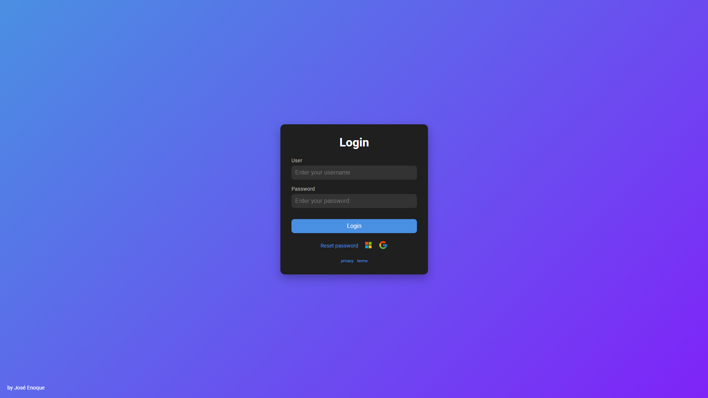

# Login

## Visão Geral
Este projeto é uma interface web simples e responsiva, projetada para suportar login de usuários com tratamento adicional de erros para um cenário "Página Não Encontrada" (404). Ele usa um design limpo com estilos consistentes, incluindo recursos modernos de CSS para transições suaves e responsividade do layout.

**Acesse o projeto aqui**: [Login Interface](https://login-indol-seven.vercel.app/index.html)

---

## Estrutura de Arquivos

### 1. `index.html`
- **Descrição**: Esta é a página HTML principal para login de usuários.
- **Conteúdo**:
  - Um formulário de login com campos para "username" e "password".
  - Opções de login externo usando Google e Microsoft.
  - Links para redefinição de senha, política de privacidade e termos.
  - Um rodapé com a assinatura do criador: "by José Enoque".
- **Estilo e Fontes**:
  - Utiliza a fonte `Roboto` para um visual moderno e limpo.
  - Vinculado ao `styles.css` para estilização personalizada.

### 2. `404.html`
- **Descrição**: Uma página de erro 404 personalizada.
- **Conteúdo**:
  - Exibe uma mensagem: "Oops! Algo deu errado..." com uma imagem e um link de navegação de volta à página inicial.
  - Inclui estilização externa de `404.css`.

### 3. `styles.css`
- **Objetivo**: Fornece a estilização para o `index.html`.
- **Recursos**:
  - Usa um fundo em gradiente linear para um visual moderno e vibrante.
  - Estilos para a caixa de login, botões, campos de entrada e outros elementos.
  - Design responsivo com media queries para ajustar o layout em telas menores.
  - Efeitos de hover suaves para interações.

---

## Configurações e Regras

### Arquivo `.htaccess`
- Utilizado para gerenciar configurações do servidor, como redirecionamentos.

### `vercel.json`
- **Configuração**:
  - Redireciona a rota principal ("/") para `index.html`.
  - Configura todas as outras rotas para redirecionar para `404.html`.

---

## Como Usar
1. Abra o `index.html` no seu navegador para acessar a interface de login.
2. Se ocorrer um erro ou uma página não for encontrada, `404.html` será carregada automaticamente.

---

### 🖼️ Projeto

  

### License

Para mais detalhes, consulte o arquivo **[LICENSE](/LICENSE)**

---

